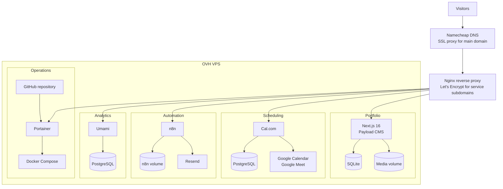

# Production architecture

The portfolio runs on a single OVH VPS. Nginx is the public entry point for
the application subdomains, while Portainer manages the Git-backed Docker
Compose deployment. Each application owns its persistent data store.

## Event flows

- The portfolio sends contact submissions to n8n over the internal Docker
  network.
- Cal.com sends `BOOKING_CREATED` events to the public n8n webhook.
- Cal.com creates calendar events and Google Meet links through Google OAuth.
- Cal.com sends native booking emails through Resend SMTP.
- n8n sends workflow emails through the Resend API.
- Browser clients load Umami's tracking script and submit analytics events
  through the analytics subdomain.

## Public routes

| Host | Destination |
| --- | --- |
| `melhachimi.com` | Next.js and Payload CMS |
| `portainer.melhachimi.com` | Portainer on the Docker host |
| `automation.melhachimi.com` | n8n |
| `book.melhachimi.com` | Cal.com |
| `analytics.melhachimi.com` | Umami |
